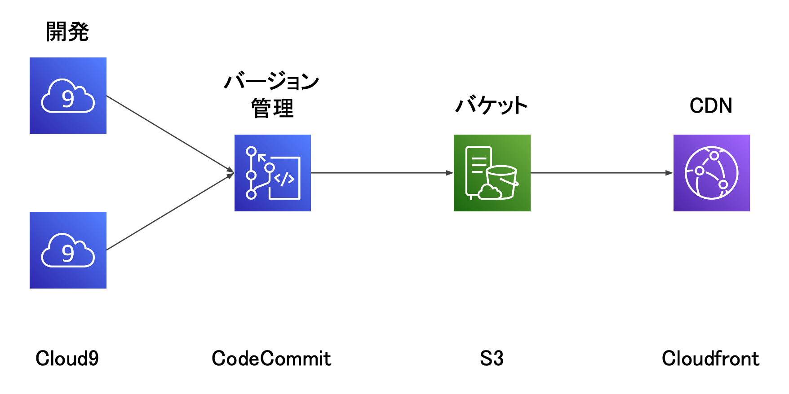

## 成果物紹介

### インターンシップ

- 2021.8 ニフティ株式会社　チーム開発3days
- 2021.9 [株式会社ウェザーニューズ　防災チャットボットコース5days](#ハザードマップの実装と情報可視化アプリ)
- 2021.9 東日本電信電話株式会社 セキュリティ/DS/DX開発5days
- 2021.9 株式会社ナビタイムジャパン　エンジニア体験3days

### チーム開発

- 2019.6 ~ 2019.7 IP電話の機能追加
- 2019.11 ~ 2019.12 音声対話システムの構築
- 2022.1 ~ 逆評定システムの構築（進行中）

### 個人開発

- 2019.11 自然言語処理を用いた著者推定プログラム
- 2020.1 Yahooニュースのキーワードの可視化アプリ
- 2021.1 自己聴取音を生成するVoice Converterの構築
- 2021.7 日本各地の平均気温の可視化アプリ
- 2022.1 簡易ToDoアプリ（Android）

### ハザードマップの実装と情報可視化アプリ

- 時期：2021.9

- 背景
  - 株式会社ウェザーニューズ　防災チャットボットコース5daysインターン
  - チーム開発(インターン生2名＋メンター1名)

- 技術
  - フロントエンド：TypeScript/React.js
  - インフラ：AWS

- 概要
  - react-leafletライブラリを使ってハザードマップの実装に取り組み、特定の場所をマーカーで表示できるようにしました。
  - パフォーマンスの改善面では、マーカーを個別のDOM要素として追加するのではなく、代わりに静的なCanvasにレンダリングするようにしました。
  - なお、下記の図に示したように、AWSのCloud9で開発を行い、CodeCommitでバージョン管理を行いました。
  - その後、生成したSDKなどの必要なファイルをS3に投げ、Cloudfrontでデプロイしました。
  - この一連の作業を自動化させるために、シェルスクリプトを用いてCI/CDの作成を工夫しました。

- 感想
  - ハザードマップの実装を通じて、防災速報アプリの重要性を感じました。
  - スクラム手法を用いたアジャイル開発を通じて、効率が上がることを実感してとても勉強になりました。
  - 今後、検索機能やスマホ対応などの課題に取り組み、ユーザの立場でUI/UXを改善したいと思います。

アプリの全体像

https://user-images.githubusercontent.com/63705408/148248365-0201f728-fc1a-4049-a3c6-4880dd7eb52f.mov

パフォーマンス改善前

https://user-images.githubusercontent.com/63705408/148247557-ce16709f-6977-4a90-a39b-36791fbecf28.mov

パフォーマンス改善後

https://user-images.githubusercontent.com/63705408/148248424-f2b573ef-4117-49fb-bc79-e248f4470b0e.mov

